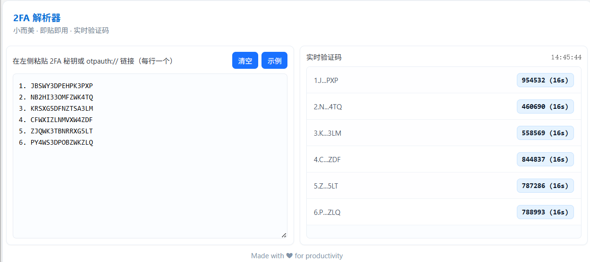
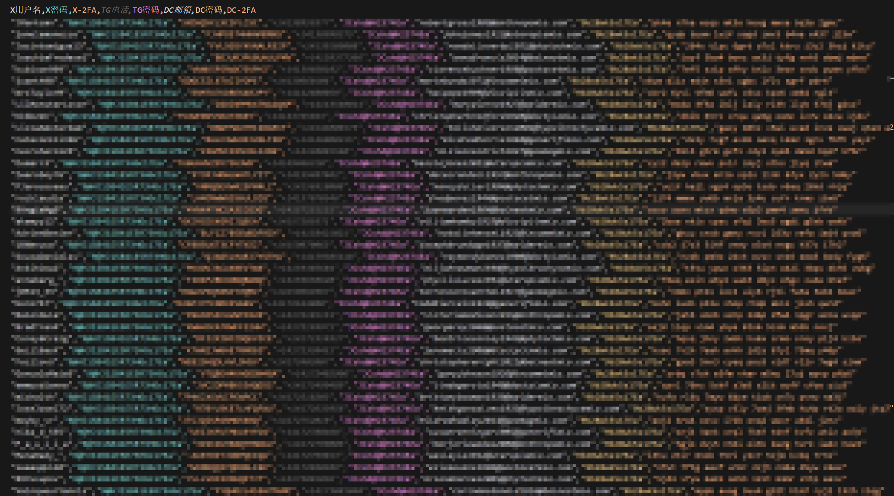
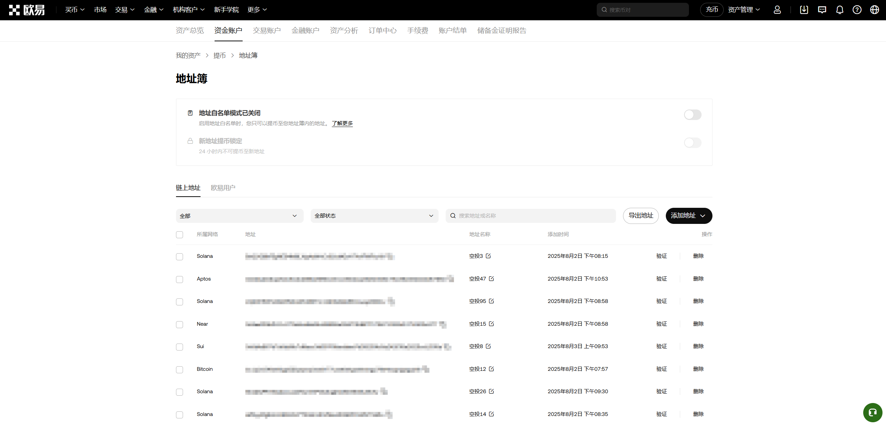
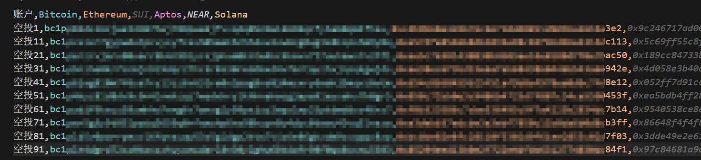
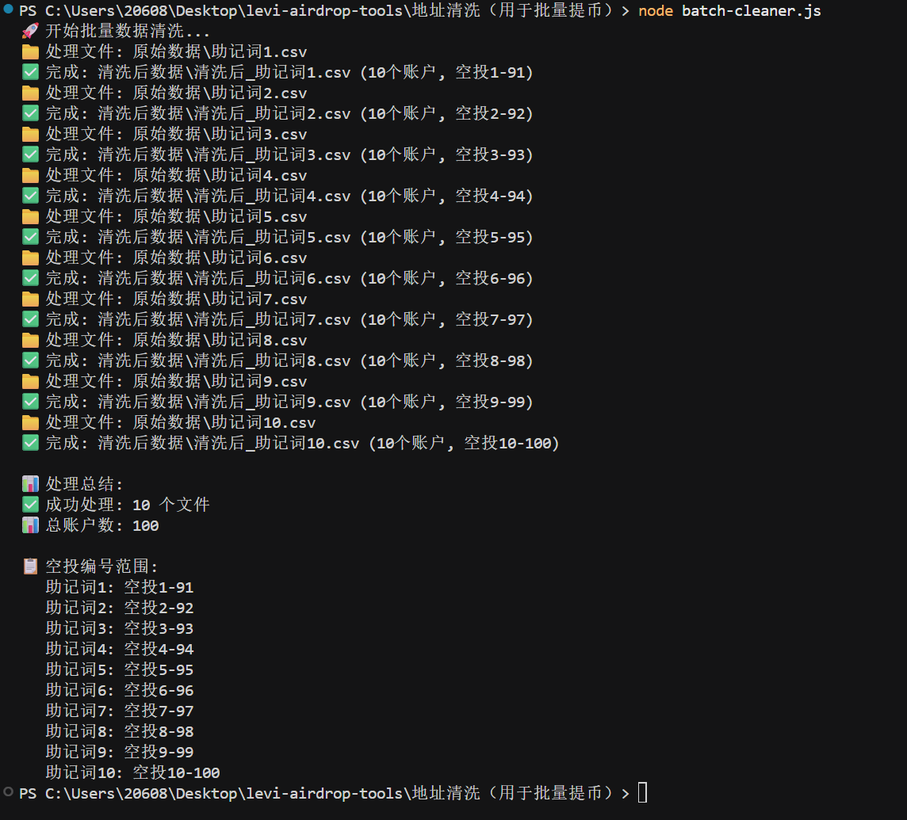
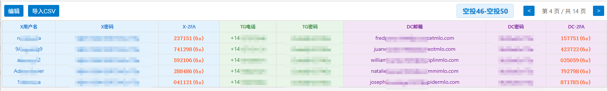
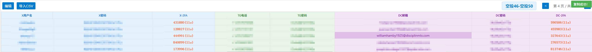

# 个人撸毛工具集

一套完整的空投工具集，包含账号管理、地址处理、2FA验证码生成和自动化操作等功能。

## 📦 项目结构

```
levi-airdrop-tools/
├── 2FA 解析器/              # 2FA验证码生成工具
├── 三件套提取脚本/          # DC/Telegram/X账号提取工具
├── 地址处理系统/            # Playwright自动化地址处理
├── 地址清洗（用于批量提币）/ # 区块链地址清洗工具
└── 快速复制工具/            # 账号信息快速复制工具
```

## 🛠️ 功能模块

### 1. 2FA 解析器

一个轻量级的Web工具，用于解析和生成TOTP验证码并直接复制。

**功能特点：**
- ✅ 支持Base32密钥和`otpauth://`链接格式
- ✅ 实时生成验证码，自动更新倒计时
- ✅ 一键复制验证码
- ✅ 支持多个密钥同时管理
- ✅ 纯前端实现，无需服务器

**使用方法：**
1. 打开 `2FA 解析器/index.html`
2. 在左侧粘贴2FA密钥（每行一个）
3. 右侧实时显示验证码，点击即可复制

**支持格式：**

- Base32密钥：`JBSWY3DPEHPK3PXP`
- otpauth链接：`otpauth://totp/Example:demo?secret=JBSWY3DPEHPK3PXP&issuer=Example`

**界面预览：**



---

### 2. 三件套提取脚本

用于**不同号商购买的不同格式原始数据合并为统一格式方便后续处理**。

**功能特点：**

- ✅ 批量提取DC/X/TG账号信息
- ✅ 支持批次处理（每批10个账号）
- ✅ 自动获取2FA验证码（DC账号）
- ✅ 提取Telegram设备验证码
- ✅ 合并三件套数据为CSV格式

**安装依赖：**
```bash
cd 三件套提取脚本
npm install
```

**使用方法：**

**DC账号提取：**
```bash
node script/DC账号提取脚本.js
```

**X账号提取：**

```bash
node script/X账号提取脚本.js
```

**Telegram账号提取：**
```bash
node script/Telegram账号提取脚本.js
```

**合并数据：**
```bash
node script/数据提取合并脚本.js
```

**输出文件：**
- `copy_data/三件套合并数据.csv` 

**界面预览：**



---

### 3. 批量添加处理区块链地址

基于Playwright的自动化系统，用于**批量添加处理地址到交易所设置白名单方便后续API批量提币**

**功能特点：**

- ✅ 自动化添加地址到OKX交易所
- ✅ 支持多链地址（Bitcoin、Ethereum、SUI、Aptos、NEAR、Solana）
- ✅ CSV数据读取和处理
- ✅ 登录状态持久化

**安装依赖：**
```bash
cd 地址处理系统
npm install
npm run install:browsers
```

**运行测试：**
```bash
# 运行所有测试
npm test

# 有界面模式
npm run test:headed

# UI模式
npm run test:ui
```

**测试文件：**
- `tests/OKX.spec.ts` - OKX地址簿自动化添加
- `tests/bilibili.spec.ts` - Bilibili自动化测试

**数据格式：**
CSV文件应包含以下列：
- 账户（空投编号）
- Bitcoin
- Ethereum
- SUI
- Aptos
- NEAR
- Solana

**界面预览：**



---

### 4. 地址清洗（用于批量提币）

**用于清洗OKX钱包直接导出的原始CSV格式的区块链地址数据，只保留指定的链，并按照空投编号规则重命名账户。**

**功能特点：**
- ✅ 只保留6个主要链（Bitcoin、Ethereum、SUI、Aptos、NEAR、Solana）
- ✅ 智能重命名账户（按空投编号规则）
- ✅ 批量处理多个助记词文件
- ✅ 提取Ethereum地址用于批量提币

**空投编号规则：**
```
空投编号 = 账户编号 × 10 - (10 - 助记词编号)
```

**示例：**
| 助记词编号 | 账户编号 | 空投编号 |
| ---------- | -------- | -------- |
| 1          | 1        | 空投1    |
| 1          | 2        | 空投11   |
| 2          | 1        | 空投2    |
| 10         | 10       | 空投100  |

**使用方法：**

**批量处理：**
```bash
cd 地址清洗（用于批量提币）
node batch-cleaner.js
```

**处理单个文件：**
```bash
node batch-cleaner.js --single 1
```

**提取Ethereum地址：**
```bash
node EVM_address.js
```

**输入文件：**
- `原始数据/助记词1.csv` ~ `助记词10.csv`

**输出文件：**
- `清洗后数据/清洗后_助记词1.csv` ~ `清洗后_助记词10.csv`
- `ETH地址数据/EVM_addresses.csv`

**界面预览：**





---

### 5. 快速复制工具

**用于快速查看和复制账号信息，支持2FA验证码实时生成，点击任何单元可直接复制。**

**功能特点：**
- ✅ CSV数据导入
- ✅ 分页显示（每页5条）
- ✅ 实时生成2FA验证码
- ✅ 一键复制账号信息
- ✅ 本地存储数据持久化
- ✅ 支持编辑模式

**使用方法：**
1. 打开 `快速复制工具/index.html`
2. 点击"导入CSV"按钮，选择三件套合并数据CSV文件
3. 使用分页按钮浏览账号
4. 点击任意单元格复制内容
5. 点击验证码可直接复制

**数据格式：**
CSV文件应包含以下列：
- X用户名、X密码、X-2FA
- TG电话、TG密码
- DC邮箱、DC密码、DC-2FA

**界面预览：**





---

## 🔧 技术栈

- **前端工具：** HTML5、CSS3、JavaScript (ES6+)
- **后端脚本：** Node.js
- **自动化测试：** Playwright、TypeScript
- **数据处理：** CSV解析、文件操作

## 📋 依赖要求

### Node.js 环境
- Node.js 14+ 
- npm 或 yarn

### 浏览器支持
- Chrome/Edge (推荐)
- Firefox
- Safari

## 🚀 快速开始

### 1. 克隆仓库
```bash
git clone <repository-url>
cd levi-airdrop-tools
```

### 2. 安装各模块依赖

**三件套提取脚本：**
```bash
cd 三件套提取脚本
npm install
```

**批量添加处理区块链地址：**
```bash
cd 批量添加处理区块链地址
npm install
npm run install:browsers
```

### 3. 使用工具

各模块可独立使用，根据需求选择相应的工具。

## 🔒 数据安全

### 敏感数据处理

项目提供了马赛克处理脚本，用于保护敏感数据：

**地址清洗工具：**
```bash
cd 地址清洗（用于批量提币）
node mask-sensitive-data.js
```
- 自动处理所有CSV文件中的区块链地址
- 保留文件结构和账户名
- 对地址进行马赛克处理

**快速复制工具：**
```bash
cd 快速复制工具
node mask-sensitive-data.js
```
- 处理账号信息CSV文件
- 对用户名、密码、邮箱、电话等进行马赛克处理

## 📝 注意事项

1. **数据安全：** 所有工具都在本地运行，数据不会上传到服务器
2. **文件格式：** 确保CSV文件使用UTF-8编码
3. **2FA密钥：** 妥善保管2FA密钥，不要泄露
4. **自动化操作：** 使用Playwright自动化时，注意遵守网站使用条款
5. **敏感数据：** 上传到GitHub前，请使用马赛克脚本处理所有敏感数据

## 🤝 贡献

欢迎提交Issue和Pull Request来改进这个项目！

## 📄 许可证

MIT License

---

**Made with ❤ for productivity**

